# Glowhub

**A multi-tenant SaaS platform for salons and beauty parlours** — every salon
gets its own branded booking website and a dashboard to run appointments,
staff, services, customers and revenue from, instead of juggling bookings
through Facebook Messenger or WhatsApp.

Register → get a subdomain in seconds → share the link → take bookings.

```
beautyqueen.glowhub.app  →  that salon's public site, live in minutes
```

One Laravel + MySQL database serves every tenant (`organization_id` on
every scoped table); one Vue SPA renders both the public booking
experience and the owner's dashboard, switching on the request's host.

---

## Screenshots

### Public site — discovery, shopfront, booking

| Marketing home | Cross-tenant salon search |
|---|---|
| 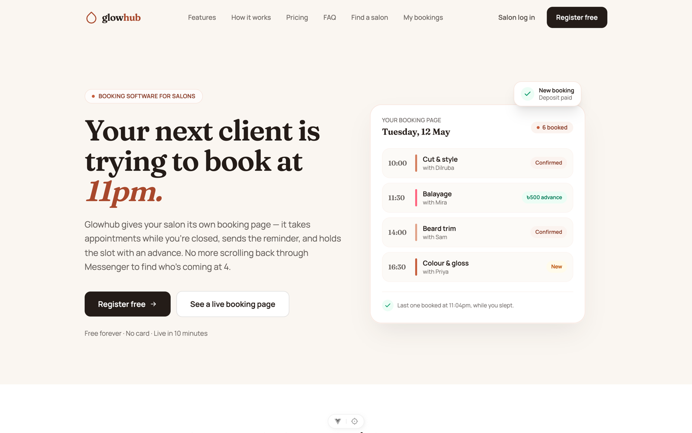 | 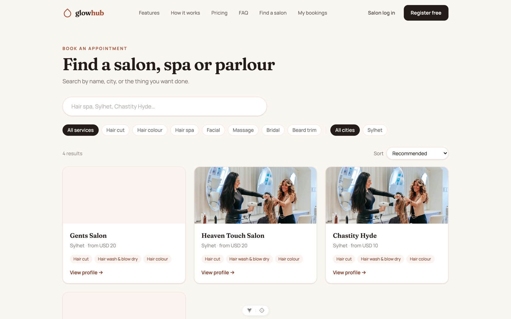 |

| A salon's public shopfront | The booking flow a customer completes |
|---|---|
| 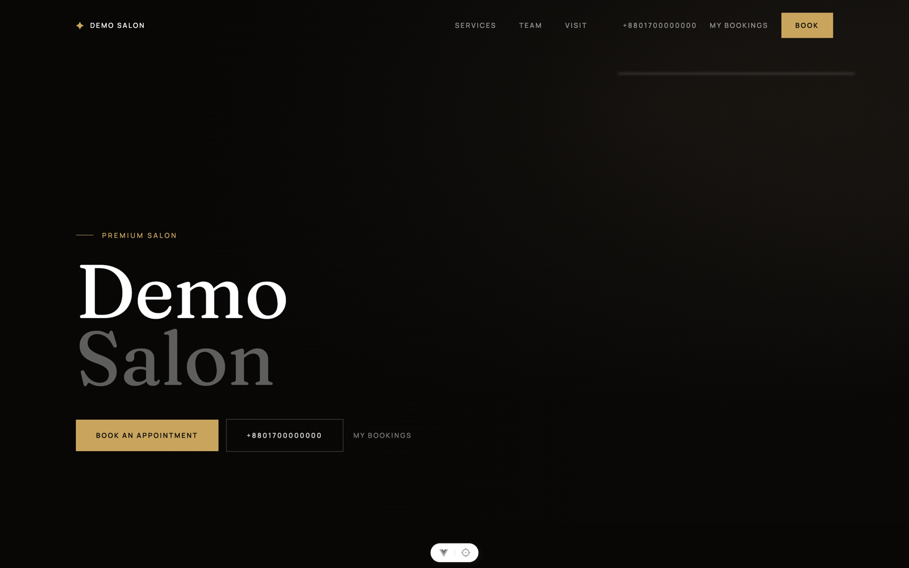 | 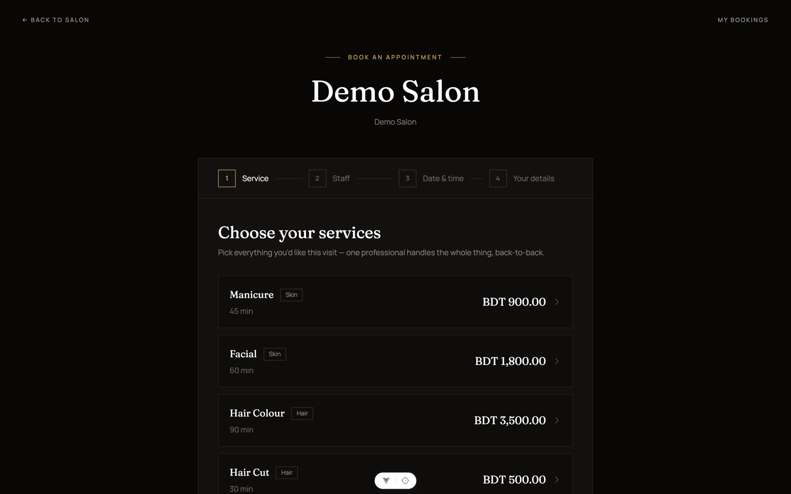 |

### Owner dashboard

| Dashboard overview | Calendar |
|---|---|
| 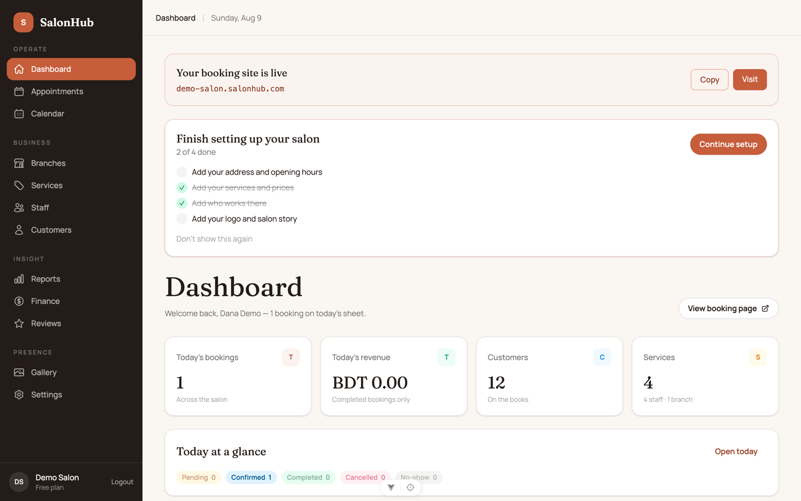 | 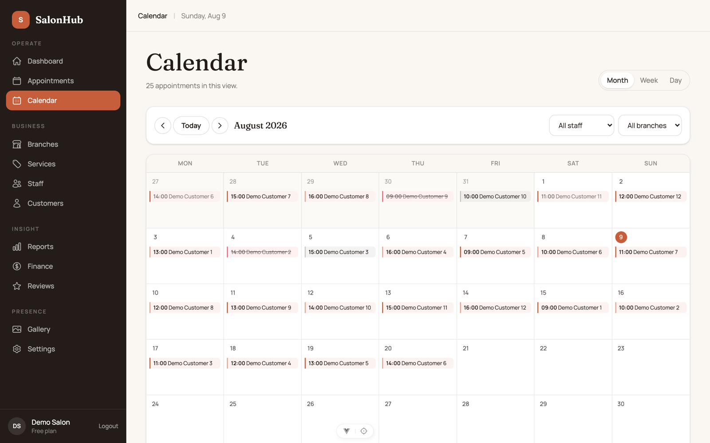 |

| Appointments | Staff |
|---|---|
| 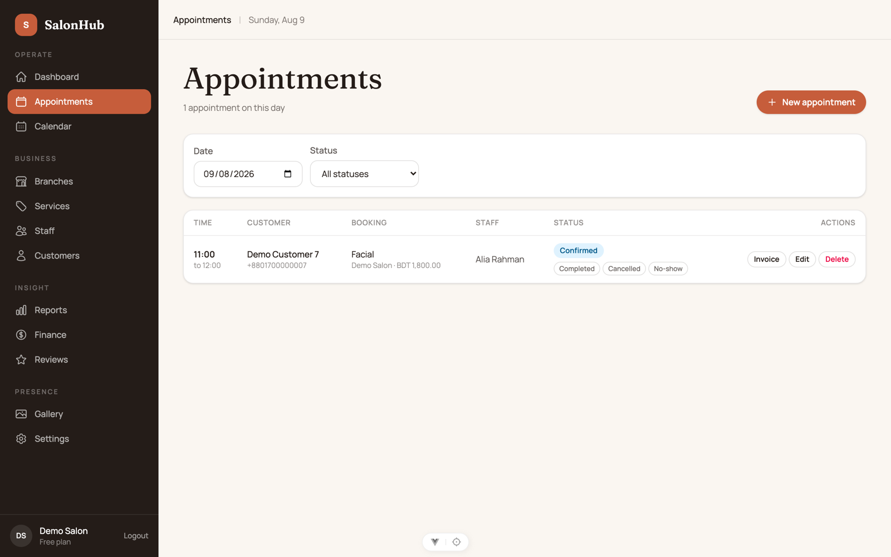 | 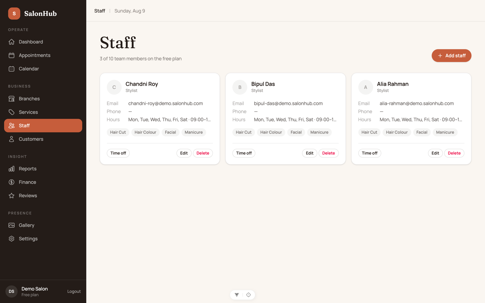 |

| Services & categories | Customers |
|---|---|
| 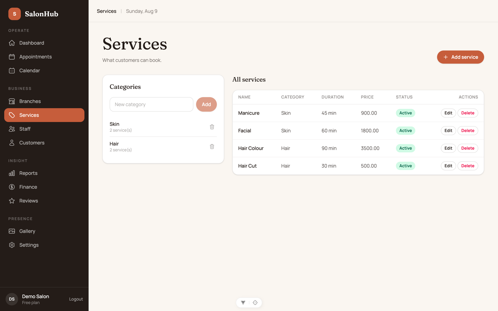 | 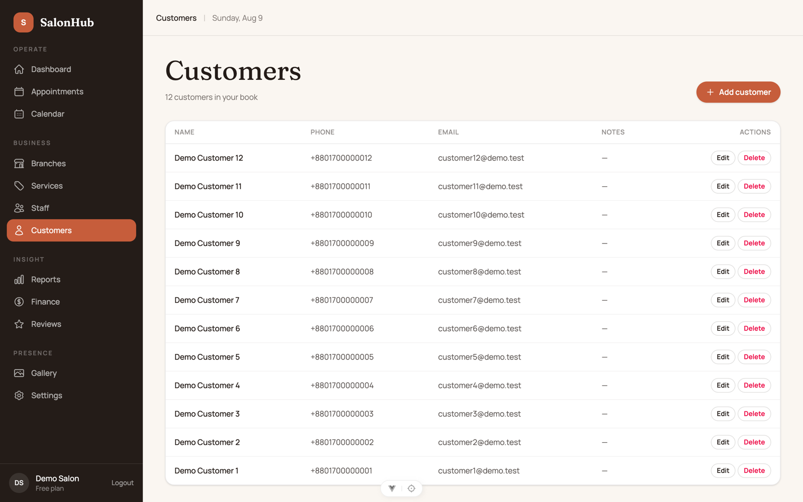 |

| Salon settings — branding, hours, payments, reminders |
|---|
| 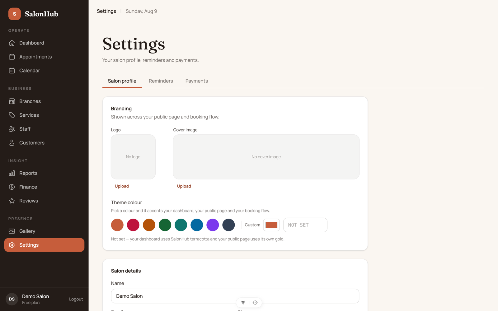 |

*(All screenshots are the real app, running locally against the seeded
demo salon — `php artisan db:seed --class=DemoSalonSeeder`, see below.)*

---

## What it does

- **Public booking site per salon** — hero, services, team, gallery,
  Google Maps location, and a 4-step booking flow (service → staff →
  date/time → details), reachable at both a subdomain and a `/salon/:slug`
  path on the apex domain.
- **Cross-tenant salon search** (`/salons`) — customers who don't know a
  salon's exact URL can find one by name, city or service.
- **Owner/manager/staff dashboard** — appointments, a month/week/day
  calendar, staff with working hours and per-staff services, a service
  catalogue with categories, a customer book (auto-created on first
  booking), branches, a photo gallery, and reviews.
- **Finance & reports** — daily revenue, completed-bookings totals, and
  reporting views scoped to the signed-in salon.
- **Automated reminders** — pluggable reminder channels (SMS/WhatsApp via
  Twilio, or a log channel for local dev), configured per salon.
- **Payments** — a pluggable payment-gateway integration with per-salon,
  encrypted credentials (`PaymentSetting`/`ReminderSetting` both cast their
  `credentials` column to `encrypted:array` under `APP_KEY`).
- **Guided onboarding** — a 4-step wizard (address & hours → services →
  staff → done) that a new owner is only ever routed through once.
- **Role-based access** — owner / manager / staff, enforced by both route
  guards on the frontend and policies on the backend.
- **Free-plan limits** — enforced server-side (1 branch, 10 staff) so the
  plan model is a real constraint, not just marketing copy.
- **Self-service customer accounts** — customers can log in to view,
  reschedule or cancel their own bookings without a dashboard account.

---

## Stack

**Backend** — Laravel 12, PHP 8.4, MySQL, Redis, Laravel Sanctum, Sentry
error monitoring. Layered as thin controllers → Form Requests → Actions /
Services → Eloquent models, with 76 backend feature/unit tests across
auth, tenancy, booking, finance, reminders, onboarding and authorization.

**Frontend** — Vue 3.5 (Composition API), Vue Router, Pinia, Axios,
Tailwind CSS 4, Vite 8. 45 component/store/router spec files, run with
Vitest.

**Infrastructure** — Nginx, Supervisor (queue worker), cron (scheduler),
Cloudflare, DigitalOcean VPS. Deploy runbook below.

**Multi-tenancy** — single shared database; every tenant-scoped table
carries `organization_id`; the current tenant is resolved once per request
from the `Host` header (`app/Tenancy/CurrentTenant.php`) and every query is
scoped to it — a salon can never see another salon's data.

---

## Local setup

### Backend (`backend/`)

```bash
cd backend
composer install
cp .env.example .env
php artisan key:generate
php artisan migrate
php artisan serve
```

`.env.example` defaults to a local SQLite connection and log-driver mail,
so the four commands above are enough to get a working API — no MySQL or
Redis required for local dev. `APP_DOMAIN` (default `glowhub.com`)
controls what subdomain each organization is served on.

Seed a fully populated demo salon (services, staff, customers,
appointments — the data behind every screenshot above):

```bash
php artisan db:seed --class=DemoSalonSeeder
```

Log in with `demo@glowhub.com` / `password` afterwards. Two things to
know before running it:

- It **refuses to run unless `APP_ENV` is `local` or `testing`** — it
  won't do anything on a server, by design.
- It's destructive on its own data: each run deletes and recreates the
  demo organization it created last time, so it's safe to re-run whenever
  you want fresh demo data.

### Frontend (`frontend/`)

```bash
cd frontend
npm install
npm run dev
```

Requires Node `^22.18.0` or `>=24.12.0` (see `frontend/package.json`
`engines`). The dev server proxies `/api` and `/storage` to
`http://127.0.0.1:8000`, so no CORS setup is needed locally.

## Tests

```bash
# Backend (PHPUnit via Artisan) — 76 tests
cd backend
php artisan test

# Frontend (Vitest) — 45 spec files
cd frontend
npm run test:unit
```

## CI

`.github/workflows/ci.yml` runs on every push to `main` and every pull
request, in two independent jobs:

- **backend:** installs Composer dependencies on PHP 8.4, runs
  `php artisan test`, then checks formatting with `./vendor/bin/pint --test`.
- **frontend:** installs npm dependencies on Node 22, runs `npm run build`,
  then `npm run test:unit`.

## Documentation

- [`CLAUDE.md`](CLAUDE.md) — the product brief: vision, tenant model, MVP
  feature scope and roadmap.
- [`docs/configuration.md`](docs/configuration.md) — every env key and
  per-salon setting behind email, SMS/WhatsApp reminders, payments and error
  monitoring, for local development and production.
- [`backend/docs/deploy/README.md`](backend/docs/deploy/README.md) — the
  production deployment runbook (nginx, the queue worker, the scheduler
  cron, backups and the restore drill).
- [`docs/superpowers/plans/`](docs/superpowers/plans/) — implementation
  plans for past and in-flight feature work.
